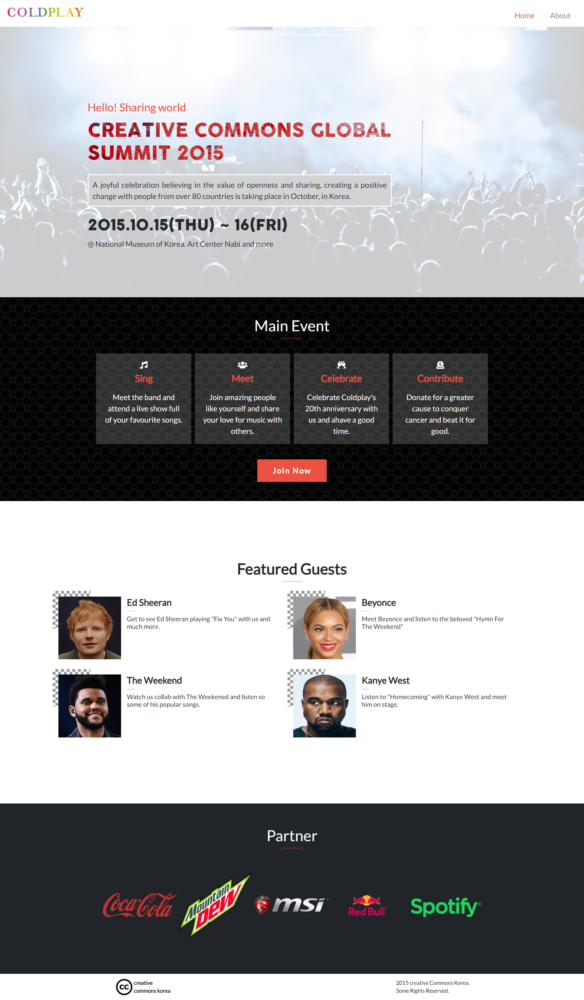

# Coldplay Event Website

> This project represents an event for an upcoming Coldplay concert featuring guests.

## Built With

- HTML
- CSS
- JavaScript
- Bootstrap 5

## Live Demo

[Live Demo Link](https://shadyshawkat.github.io/Module1-Capstone/)

## Video

[Here](https://www.loom.com/share/b7cde61edc814cd5b57b2f0b7eba373b) is a video of me walking you through the website and talking over the main features. 

## Getting Started

To get a local copy up and running follow these simple example steps.

1- Navigate to the button on the top right green "code" button.
2- In the drop down menu choose "Download Zip".
3- After extracting the files, you'll have my project on your local machine.

👤 **Shady Shawkat**

- GitHub: [@shadyshawkat](https://github.com/ShadyShawkat)
- Twitter: [@shadyshawkat](https://twitter.com/ShadyShawkat3)
- LinkedIn: [shadyshawkat](https://www.linkedin.com/in/shady-shawkat/)

## Show your support

Give a ⭐️ if you like this project!

## Acknowledgments

Template was provided by Cindy Shin on Behance and you can view it [here](https://www.behance.net/gallery/29845175/CC-Global-Summit-2015)

## 📝 License

This project is [MIT](./MIT.md) licensed.